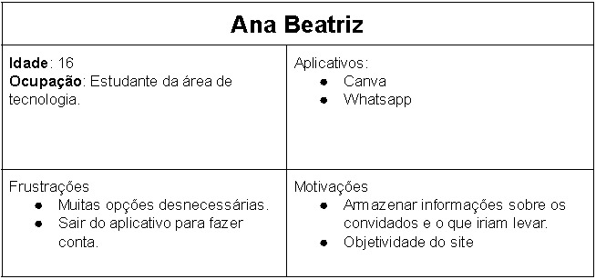
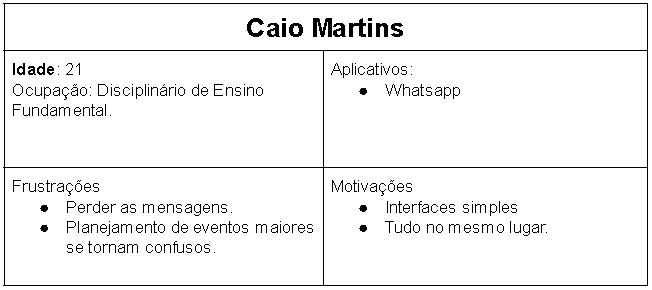
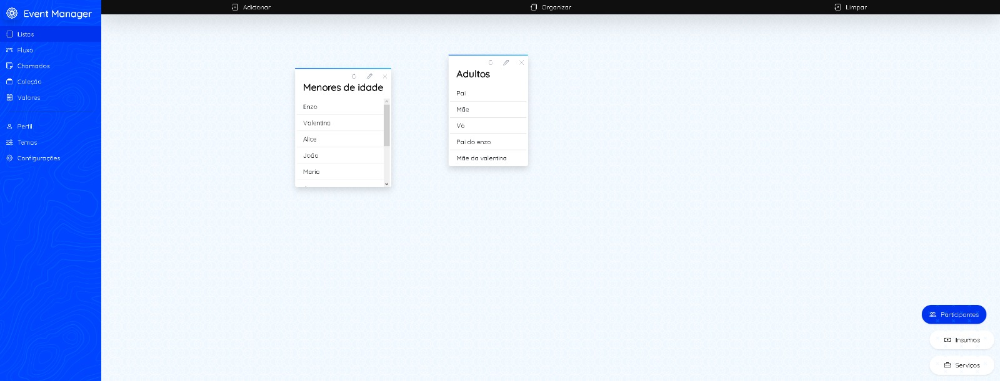
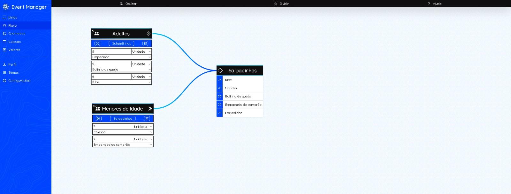
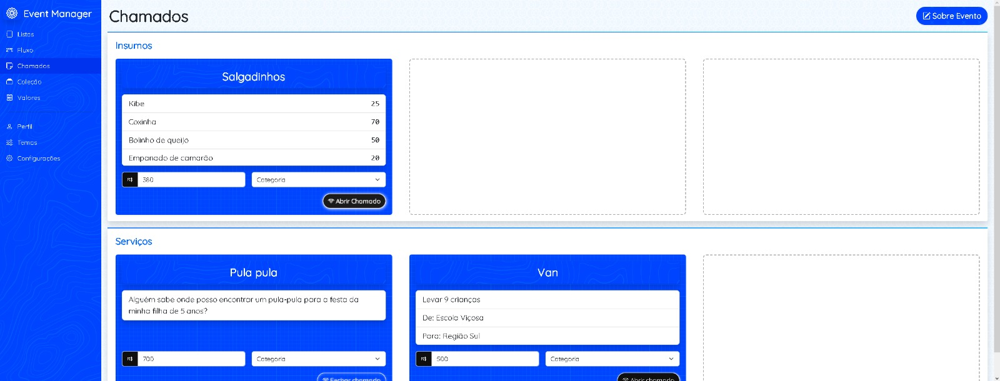
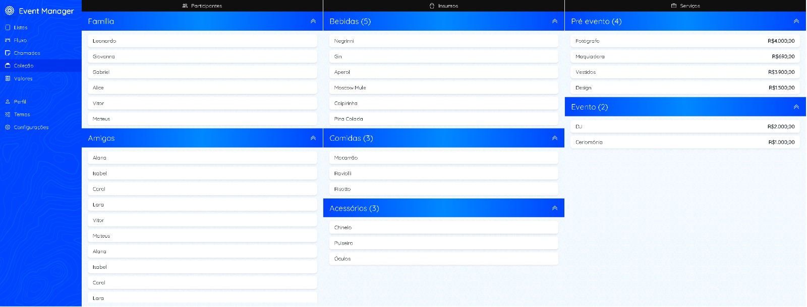
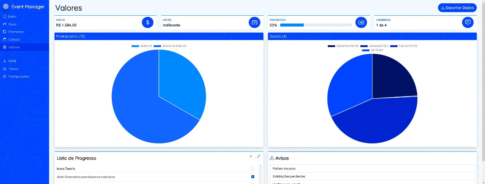
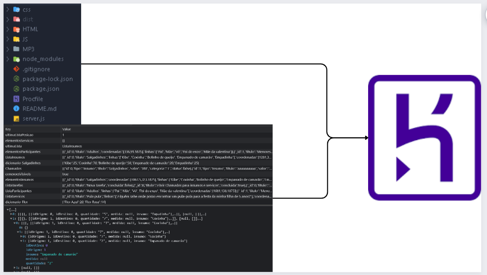

# Informações do Projeto:

### `TÍTULO:` **Event Manager**

### `CURSO:` **Engenharia de Software**

## Participantes:

* Luís Felipe Teixeira Dias Brescia
* Bernardo Carvalho Denucci Mercado
* Thiago Cury Freire
* Vitor Rebula Nogueira

# Estrutura do Documento

- [Informações do Projeto](#informações-do-projeto)
  - [Participantes](#participantes)
- [Estrutura do Documento](#estrutura-do-documento)
- [Introdução](#introdução)
  - [Problema](#problema)
  - [Objetivos](#objetivos)
  - [Justificativa](#justificativa)
  - [Público-Alvo](#público-alvo)
- [Especificações do Projeto](#especificações-do-projeto)
  - [Personas e Mapas de Empatia](#personas-e-mapas-de-empatia)
  - [Histórias de Usuários](#histórias-de-usuários)
  - [Requisitos](#requisitos)
    - [Requisitos Funcionais](#requisitos-funcionais)
    - [Requisitos não Funcionais](#requisitos-não-funcionais)
  - [Restrições](#restrições)
- [Userflow](#projeto-de-interface)
- [Metodologia](#metodologia)
  - [Ferramentas](#ferramentas)
  - [Controle de Versão](#controle-de-versão)
- [Projeto da Solução](#projeto-da-solução)
  - [Tecnologias Utilizadas](#tecnologias-utilizadas)
  - [Arquitetura da solução](#arquitetura-da-solução)
- [Avaliação da Aplicação](#avaliação-da-aplicação)
  - [Plano de Testes](#plano-de-testes)
  - [Registros de Testes](#registros-de-testes)
- [Referências](#referências)

# Introdução

Neste contexto a palavra "evento" pode significar qualquer tipo de atividade onde tenha múltiplas pessoas envolvidas, como um jogo de futebol, ida a um show, campanha beneficente de moletom, churrasco, festa de formatura, casamento, uma saida com os amigos, desenvolvimento de um jogo, criação de uma música, acampamento, viagem em grupo, entre outros.

Dito isso, durante o planejmanto de um evento devemos levar em consideração diversos fatores, dentre eles, número de convidados, local, comida, bebida, fotógrafo, motorista, ingresso.

## Problema

A dificuldade não está apenas em avaliar quais serão os gastos necessários e estimar o valor de cada um deles, mas também em encontrar alguém para suprir aquela demanda, o que atualemente costuma ser feito por pesquisas na internet, indicação de amigos, redes sociais... O que pode ser um processo demorado e cansativo, além de dificultar a comparação de preços e não garantir a qualidade do serviço.

## Objetivos

Juntar de uma forma concisa ferramentes necessárias para o planejamento de um evento, desenvolvendo uma forma mais eficiente, fácil, e rápida de planeja-lo.

Como objetivos específicos, podemos ressaltar:
* Estimar valor de um evento.
* Estimar a quantidade de cada insumo em um evento.
* Organizar e armazenar dados sobre o evento.
* Facilitar a conexão entre o organizador e os fornecedores.

## Justificativa

Diversas pessoas utilizam ferramentas como excel, whatsapp, e até mesmo papel e caneta para organizar seus eventos, acreditamos que uma ferramenta que junte todas essas funcionalidades em um só lugar, de forma simples e intuitiva, pode ser muito útil para o público alvo, já que atualmente nenhuma ferramenta acessível é capaz de fazer isso de forma dinâmica, permitindo alterações tanto do organizador quanto do fornecedor. 

## Público-Alvo

Tanto organizadores de eventos quanto fornecedores podem se beneficiar do site, porém, o foco no momento é direcionado aos organizadores, visto que o site sem eles não funcionaria.
 
# Especificações do Projeto

Nesta parte do documento será abordado de forma objetiva os problemas que a aplicação busca resolver, bem como as funcionalidades que ela deve apresentar. Para tanto, iremos utilizar as personas e histórias de usuários levantadas pelo grupo por meio de entrevistas com possíveis usuários.

## Personas e Mapas de Empatia

  

  

## Histórias de Usuários

> Com base na análise das personas forma identificadas as seguintes histórias de usuários:

|EU COMO... `PERSONA`| QUERO/PRECISO ... `FUNCIONALIDADE` |PARA ... `MOTIVO/VALOR`                 |
|--------------------|------------------------------------|----------------------------------------|
|Ana Beatriz | criar uma lista com os convidados e o que irão levar          | ter conhecimento do que preciso pedir.          |
|Ana Beatriz | fazer uma estimativa de custo por convidado em 1 evento        | fazer a lista de quantas pessoas vou convidar             |
|Maria Lana  | reaproveitar o planejamento de um evento      | não ter que escrever tudo novamente, e encher meu whatsapp com mensagens desnecessárias.  |
|Maria Lana  | listar, e lembrar o que falta ser avaliado         | não esquecer de algo essencial para o evento.               |
|Caio Martins | personalizar os preços médios com gastos do eventos | personalizar os preços médios com gastos do evento ter uma estimativa do custo.|
|Caio Martins | planejar o evento junto de outras pessoas          | criar grupos sobre a todo momento é desgastante.             |
|Gabriel Chagas | facilidade em adicionar gastos         | usar o teclado para fazer tudo cansa.              |
|Gabriel Chagas       | que outras pessoas saibam do que eu preciso | não gastar meu tempo procurando gente para resolver meu problema. |

## Requisitos

> As tabelas a seguir apresentam os requisitos funcionais e não funcionais que detalham o escopo do projeto.

### Requisitos Funcionais

|ID    | Descrição do Requisito  | Prioridade |
|------|-----------------------------------------|----|
|RF-001| Possibilitar o usuário de criar listas de participantes para o seu evento | Alta | 
|RF-002| Possibilitar o usuário de listar elementos que deseja em seu evento | Alta |
|RF-003| Auxiliar o usuário calcular a quantidade necessária de cada insumo para seu evento | Alta |
|RF-004| Possibilitar o usuário de criar múltiplas demandas para seu evento | Alta |
|RF-005| Permitir que o usuário especifique o que será considerado um gasto em cada evento |Alta|
|RF-006| Estimar o valor de um evento com base nos participantes, insumos e serviços | Alta |
|RF-007| Possibilitar o usuário de compartilhar uma demanda com outros usuários | Média |
|RF-008| Lista de afazeres para auxiliar organização do evento | Média |
|RF-009| Permitir que o usuário seja específico quanto á algum serviço do seu evento | Média |
|RF-010| Recomendar mudanças sobre o planejamento de um evento |Baixa|
|RF-011| Utilizar algum meio para reconhecer o preço médio de um produto (API) |Baixa|
|RF-012| Diferenciar diferentes eventos |Baixa|
|RF-013| Permitir que mais de uma pessoa planeje cada evento |Baixa|
|RF-014| Permitir ao usuário personalizar um elemento em específico de uma lista | Baixa |

### Requisitos não Funcionais

|ID     | Descrição do Requisito  |Prioridade |
|-------|-------------------------|----|
|RNF-001| O site deverá ser de intuitivo | Alta |
|RNF-002| Página não deverá ser recarregadada a cada mudança realizada | Alta | 
|RNF-003| O site deverá apresentar responsividade | Média | 
|RNF-004| Todas as páginas deverão rodar de forma fluída | Baixa |

## Restrições

> Regras eu deverão ser seguidas a risca durante desenvolvimento do projeto

| ID | Restrição                                             |
| -- |-------------------------------------------------------|
| RE-01 | O projeto deverá ser entregue até o final do semestre. |
| RE-02 | A equipe deverá reportar todo o desenvolvimento no Trello. |
| RE-03 | A equipe não pode subcontratar o desenvolvimento do trabalho. |
| RE-04 | As tecnologias utilizadas devem restringir à HTML, CSS e JavaScript. |

# Userflow

> 1° Listas: Organizando entre as categorias Participantes, Insumos, e Serviços, o usuário deve especificar quais elementos existirão para aquele evento

> 2° Fluxo: Usuário criará relações entre as listas de particpantes e os elementos das listas de Insumos

> 3° Chamados: Usuário compartilhará sua demanda e valor que está disposto a pagar por ela, sendo contactado por aqueles interessados em supri-la  

> 4° Coleção: Usuário terá uma visão geral sobre os elementos de seu evento

> 5° Valores: Com os dados já coletados, dá uma estimativa de quanto o evento custará, e disponibilizará gráficos onde serão mostrados proporcionalidades de cada categoria

# Metodologia

Neste contexto, o grupo optou por utilizar o framework Scrum para o desenvolvimento do projeto, visto que o mesmo é um framework ágil que permite a adaptação do processo de desenvolvimento de acordo com as necessidades do projeto.

## Ferramentas

| Ambiente  | Plataforma              |Link de Acesso |
|-----------|-------------------------|---------------|
| Documentação | Google Docs | https://docs.google.com/document/d/1qjGNgSORIWJKUIP3m1bH0Y8Otmr99sSKhRu7RO_rozI/edit?usp=sharing |
| Weekly Scrum | Discord | https://discord.gg/QcnfPCfZ |
| Backlog | Trello | https://trello.com/invite/b/IRT28t7u/ATTIa9c7c509f0e7eaf3ac96967fc2edecff66B9AE32/event-manager |
| Código fonte | GitHub | https://github.com/ICEI-PUC-Minas-PMGES-TI/pmg-es-2023-1-ti1-2401100-quantofica | 
|Hospedagem do site | Heroku |  https://event-manager-tiaw-e7211e805cd0.herokuapp.com | 

> Heroku foi escolhido como plataforma de hospedagem por não exigir que o código fonte passe pelo processo de minificação, algo realizado por ferramentas como rollup, webpack, e gulp. Como o código fonte não é minificado, é possível inspeciona-lo apenas com o link de seu deploy.

## Controle de Versão

Em nosso repositório existem 3 diferentes branchs, sendo elas:

* **master**: branch principal, onde se encontra o código fonte da aplicação.
* **novo**: branch onde se encontra o código fonte da aplicação antes de ser reescrito. 
* **antigo**: branch onde se encontra a primeira versão da aplicação. 

Para realizar os **commits**, independentemente da **branch** foi utilizado o seguinte padrão:

`git commit -m "Adicionada funcionalidade x"`

> Onde a mensagem de commit deverá sempre começar com letra maiúscula e estar conjugada no particípio passado, indicando uma ação já concluída.

Quanto a gerência de **issues**, o projeto adota a seguinte convenção para etiquetas:

* `single:` afeta apenas uma funcionalidade
* `multiple:` afeta mais de uma funcionalidade

> Geralmente, funcionalidades com maior número de issues single, são as geradoras de issues multiple.

# Projeto da Solução

Nesta seção do documento será apresentado a solução desenvolvida pelo grupo para o problema apresentado na seção [Introdução](#introdução). Para tanto, será apresentado as tecnologias utilizadas, a arquitetura da solução e a forma como a solução foi desenvolvida.

## Tecnologias Utilizadas

O projeto foi desenvolvido como uma aplicação **Node Vanilla** (HTML, CSS, Javascript), utilizando o **Express** como framework para o servidor, o **localStorage** do próprio navegador como banco de dados, e **Git** para versionamento. 

Bibliotecas utilizadas para para o front-end:
* Bootstrap ( Sistema de grid )
* Bootstrap Icons ( Ícones )
* jQuery ( Programação em JavaScript mais eficiente )
* jQuery UI ( Função draggable() )
* Leader Line ( Cria uma linha entre dois elementos HTML )
* Hero Patterns ( Conjunto de texturas )

## Arquitetura da solução

### Na imagem acima podemos ver a organização das pastas e o localStorage após um uso simples do site, como o Heroku não aceita personalização da pasta raiz, tive que rodar o sguinte comando para fazer o deploy:

`git subtree push --prefix codigo heroku master`

> Onde heroku é a variável que contém o link para o repositório remoto, master é a branch que será enviada, e 'codigo' é a pasta que contém os arquivos da imagem acima.

# Avaliação da Aplicação

Nesta parte será abordado as estapas realizadas para verificar se o projeto desenvolvido se adequa nas especificações levantadas na seção [Especificação do Projeto](#especificações-do-projeto).

## Plano de Testes

Primeiramente, pegamos a tabela [histórias de usuário](#histórias-de-usuários), e verificamos se todas as histórias foram atendidas.

Após isso voltamos na tabela de requisitos, e verificamos se os requisitos foram atendidos fe forma satisfatória. 

Foi realizado planejamanto de eventos reais, visando testar a aplicação em um cenário real, e verificar se ela atendia as necessidades do usuário.

No final, fizemos um teste de usabilidade com um usuário, para ver se ele conseguia utilizar o site sem dificuldades.

## Registros de Testes

Os testes mostraram que com devida **criatividade** e esforço, é possível sim planejar um evento utilizando o site, sendo alguma das vezes, necessária uma visão um pouco mais abstrata, seria bem vindo templates pré-definidos para simplificar ainda mais o processo.

# Referências

### Sites utilizados no desenvolvimento do projeto:

* [Chat GPT](https://chat.openai.com)
* [Bootstrap](https://getbootstrap.com)
* [Bootstrap Icons](https://icons.getbootstrap.com)
* [jQuery UI](https://jqueryui.com)
* [Leader Line](https://anseki.github.io/leader-line/)
* [Hero Patterns](https://heropatterns.com)